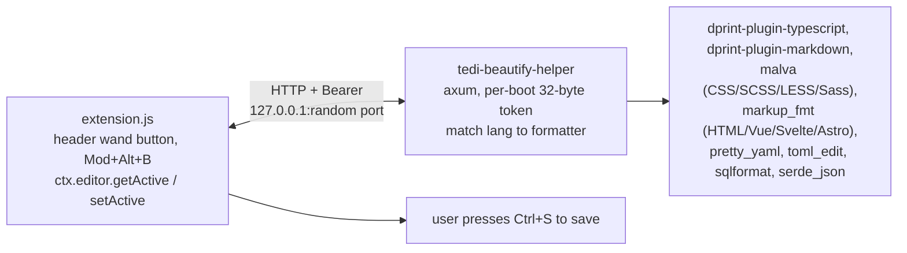

# TEDI Beautify

Zero-config formatter extension for [TEDI](https://tedi.ilhamriski.com/).
Adds a wand icon to the header (left of the markdown-preview button) or
`Mod+Alt+B`; the active editor buffer is reformatted in place and the user
presses Ctrl+S to persist. A native sidecar handles the parse and re-print so
the TEDI core binary stays free of formatter dependencies.

<p align="center">
  
</p>

> [!NOTE]
> Requires TEDI >= 0.2.27 for the `ctx.editor` host API and the
> `placement: "left"` header-button slot. On older TEDI builds the extension
> activates but the button stays out of the way and a toast explains what is
> missing.

> [!NOTE]
> The bundled sidecar binary is unsigned. The first launch on each platform may
> show SmartScreen (Windows), Gatekeeper (macOS), or nothing (Linux). See
> [Trust prompts](#trust-prompts).

---

## Install

1. Open **Settings → Extensions** in TEDI.
2. Switch to the **From GitHub** tab.
3. Paste `IlhamriSKY/TEDI.beautify` and click **Review → Install**.

Click the **wand icon** that appears next to the markdown-preview toggle in the
header, or press `Mod+Alt+B`, to format the file you have open.

## Update

In **Settings → Extensions**, click **Check updates** on this extension's
card. If a new release exists, click **Update** to reinstall in place.

## Supported languages

Same surface VSCode ships via its built-in formatters + Prettier extension,
minus a few that overlap with TEDI core or are still niche.

| Extension | Language | Backed by |
| --- | --- | --- |
| `.json`, `.jsonc`, `.json5` | JSON | `serde_json` (2-space indent; JSONC / JSON5 comments only survive strict-JSON input) |
| `.js`, `.mjs`, `.cjs` | JavaScript | `dprint-plugin-typescript` (Prettier-compatible printer) |
| `.jsx` | JSX | `dprint-plugin-typescript` |
| `.ts`, `.cts`, `.mts` | TypeScript | `dprint-plugin-typescript` |
| `.tsx` | TSX | `dprint-plugin-typescript` |
| `.css` | CSS | `malva` (g-plane) |
| `.scss` | SCSS | `malva` |
| `.less` | LESS | `malva` |
| `.sass` | Sass (indented) | `malva` |
| `.html`, `.htm`, `.xhtml` | HTML | `markup_fmt` (g-plane) |
| `.vue` | Vue | `markup_fmt` |
| `.svelte` | Svelte | `markup_fmt` |
| `.astro` | Astro | `markup_fmt` |
| `.md`, `.markdown`, `.mdx` | Markdown | `dprint-plugin-markdown` (re-flows paragraphs, normalises lists) |
| `.yaml`, `.yml` | YAML | `pretty_yaml` (g-plane, preserves comments) |
| `.toml` | TOML | `toml_edit` (preserves comments) |
| `.sql` | SQL | `sqlformat` (generic dialect, 2-space, uppercase keywords) |
| `.xml`, `.svg` | XML / SVG | depth-based reindenter (keeps attribute order intact) |

Files outside this list surface a "no formatter for this file type yet" toast on
click. Deliberately out of scope:

- **Angular component templates:** enabled in code (`langForPath("foo.angular")`
  would dispatch to `markup_fmt`'s Angular mode) but no canonical extension
  exists, so files have to be opened as `.html` to pick up formatting.
- **GraphQL, Go, Rust, Python, Ruby:** best served by their toolchain formatters
  (`gofmt`, `rustfmt`, `ruff format`, etc.). Configure them via TEDI core's
  external-formatter settings instead.

## How it works



On click the extension:

1. Picks the helper binary for the current OS / arch from `sidecar/<platform>-<arch>/`.
2. Spawns it via `shell_bg_spawn_direct` the first time (lazy boot). The sidecar
   binds `127.0.0.1` on an OS-assigned port and prints `READY {port, token}` to
   stdout.
3. Reads the `READY` line via `shell_bg_logs`.
4. POSTs `{lang, content}` to `/format` with the bearer token, reads the
   formatted text back, and applies it via `ctx.editor.setActiveContent`.
5. The buffer is now dirty; the user presses Ctrl+S to persist.

`shell_bg_kill` runs on `deactivate` so disable / uninstall stops the sidecar
cleanly. The bearer token is generated per boot and never reaches disk.

## Permissions

| Permission | Why |
| --- | --- |
| `headerbar:write` | Mounts the wand icon in the file-view-mode cluster (left of the markdown-preview toggle). |
| `ui:toast` | Surfaces format results / errors. |
| `editor:read` | Reads the active editor's live buffer via `ctx.editor.getActive`. |
| `editor:write` | Replaces the active editor's buffer via `ctx.editor.setActiveContent`. The user sees a dirty buffer and can undo or save. |
| `invoke:shell_bg_spawn_direct` | Spawns the sidecar (no shell wrapper, so the tracked PID is the helper itself). |
| `invoke:shell_bg_logs` | Reads the `READY {port, token}` handshake from the helper's stdout. |
| `invoke:shell_bg_kill` | Stops the helper on disable / uninstall. |

No filesystem, keychain, or general-network permissions. The sidecar binds
loopback only and authenticates every call with the per-boot bearer token; no
other machine on the LAN can reach it.

## Comparison with TEDI's built-in formatter

TEDI core ships a Prettier-backed `formatDocument` and the
*Settings → Editor → Formatters* page lets the user configure per-language
external commands. Beautify is **complementary**, not a replacement:

| | Beautify (this extension) | TEDI core formatter |
| --- | --- | --- |
| Config | None | Per-language config + external command paths |
| JS / TS / JSX / TSX | Bundled (dprint-plugin-typescript) | Built-in Prettier |
| HTML / Vue / Svelte / Astro | Bundled (markup_fmt) | Built-in Prettier |
| CSS / SCSS / LESS / Sass | Bundled (malva) | Built-in Prettier |
| Markdown | Bundled (dprint-plugin-markdown) | Built-in Prettier |
| TOML / SQL | Bundled (toml_edit, sqlformat) | External tool only |
| Comments preserved | TOML / YAML / CSS family yes | Depends on Prettier / external tool |
| Trigger | Wand icon, `Mod+Alt+B` | Right-click menu, format-on-save |
| Network | Loopback HTTP to the sidecar | In-process Prettier or spawned external |
| Offline | Yes (everything bundled) | Yes for built-in; external = depends on tool |

If you already have Prettier configured, keep using it. Beautify is for the
cases where you want a "just press the button" answer without installing or
wiring anything: the same surface VSCode's built-in formatters cover, packaged
as a single zero-config extension.

## Trust prompts

| Platform | First launch | How to clear |
| --- | --- | --- |
| Windows | SmartScreen ("Windows protected your PC"). | Click **More info → Run anyway** once. |
| macOS | Gatekeeper may flag the helper as quarantined. | `xattr -dr com.apple.quarantine ~/Library/Application\ Support/id.ilhamrisky.tedi/extensions/tedi.beautify/sidecar` |
| Linux | Nothing. TEDI's installer `chmod 0755`s `sidecar/` after extraction. | n/a |

## Development

```bash
git clone https://github.com/IlhamriSKY/TEDI.beautify.git
cd TEDI.beautify

# Build the native sidecar for your host.
cd sidecar-src
cargo build --release
mkdir -p ../sidecar/<platform>-<arch>      # e.g. windows-x86_64
cp target/release/tedi-beautify-helper* ../sidecar/<platform>-<arch>/
cd ..

# Build extension.js from src/ (generated by esbuild, not committed).
npm install
npm run build

# Package, then install via Settings → Extensions → From file:
zip -r dev.zip manifest.json extension.js logo.png README.md CHANGELOG.md LICENSE sidecar
```

To cut a release, tag `vX.Y.Z` and push. CI in
[`.github/workflows/release.yml`](.github/workflows/release.yml) builds the
sidecar for every supported platform and uploads the zip to the GitHub release.
