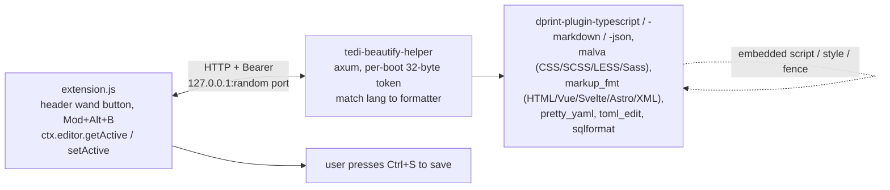

# TEDI Beautify

Zero-config formatter extension for [TEDI](https://tedi.ilhamriski.com/).
Adds a wand icon to the header (left of the markdown-preview button) or
`Mod+Alt+B`; the active editor buffer is reformatted in place and the user
presses Ctrl+S to persist. A native sidecar handles the parse and re-print so
the TEDI core binary stays free of formatter dependencies.

<p align="center">
  
</p>

> [!NOTE]
> Requires TEDI >= 0.3.9 for the `ctx.editor` host API and the
> `placement: "left"` header-button slot. On older TEDI builds the extension
> activates but the button stays out of the way and a toast explains what is
> missing.

> [!NOTE]
> The bundled sidecar binary is unsigned. The first launch on each platform may
> show SmartScreen (Windows), Gatekeeper (macOS), or nothing (Linux). See
> [Trust prompts](#trust-prompts).

---

## Install

1. Open **Settings → Extensions** in TEDI.
2. Switch to the **From GitHub** tab.
3. Paste `IlhamriSKY/TEDI.beautify` and click **Review → Install**.

Click the **wand icon** that appears next to the markdown-preview toggle in the
header, or press `Mod+Alt+B`, to format the file you have open.

## Update

In **Settings → Extensions**, click **Check updates** on this extension's
card. If a new release exists, click **Update** to reinstall in place.

## Supported languages

Same surface VSCode ships via its built-in formatters + Prettier extension,
minus a few that overlap with TEDI core or are still niche.

| Extension | Language | Backed by |
| --- | --- | --- |
| `.json` | JSON | `dprint-plugin-json` (key order, number precision and 2-space indent) |
| `.jsonc`, `.json5`, `.babelrc`, `.swcrc`, `.jshintrc`, `.jscsrc` | JSONC | same, in comment- and trailing-comma-preserving mode |
| `.js`, `.mjs`, `.cjs` | JavaScript | `dprint-plugin-typescript` (Prettier-compatible printer) |
| `.jsx` | JSX | `dprint-plugin-typescript` |
| `.ts`, `.cts`, `.mts` | TypeScript | `dprint-plugin-typescript` |
| `.tsx` | TSX | `dprint-plugin-typescript` |
| `.css`, `.pcss`, `.postcss` | CSS | `malva` (g-plane) |
| `.scss` | SCSS | `malva` |
| `.less` | LESS | `malva` |
| `.sass` | Sass (indented) | `malva` |
| `.html`, `.htm`, `.xhtml` | HTML | `markup_fmt` (g-plane) |
| `.vue` | Vue | `markup_fmt` |
| `.svelte` | Svelte | `markup_fmt` |
| `.astro` | Astro | `markup_fmt` |
| `.jinja`, `.jinja2`, `.j2`, `.twig`, `.njk`, `.nunjucks` | Jinja family | `markup_fmt` |
| `.vto` | Vento | `markup_fmt` |
| `.mustache`, `.hbs`, `.handlebars` | Mustache / Handlebars | `markup_fmt` |
| `.xml`, `.svg`, `.xsl`, `.xslt`, `.xsd`, `.wsdl`, `.rss`, `.atom`, `.plist` | XML / SVG | `markup_fmt` XML mode (keeps attribute order intact) |
| `.md`, `.markdown` | Markdown | `dprint-plugin-markdown` (re-flows paragraphs, normalises lists) |
| `.yaml`, `.yml` | YAML | `pretty_yaml` (g-plane, preserves comments) |
| `.toml` | TOML | `toml_edit` (preserves comments) |
| `.sql` | SQL | `sqlformat` (generic dialect, 2-space, uppercase keywords) |

Files outside this list surface a "no formatter for this file type yet" toast on
click. Deliberately out of scope:

- **Angular component templates:** enabled in code (`markup_fmt`'s Angular mode
  is wired up) but no canonical extension exists, so files have to be opened as
  `.html` to pick up formatting.
- **GraphQL, Go, Rust, Python, Ruby:** best served by their toolchain formatters
  (`gofmt`, `rustfmt`, `ruff format`, etc.). Configure them via TEDI core's
  external-formatter settings instead.
- **`.prettierrc`, `.eslintrc`, `.stylelintrc`:** those tools accept JSON *or*
  YAML in the same extension-less file and the name does not say which, so the
  wand stays hidden rather than offering to format a YAML one and failing on
  the first `:`. The extension-carrying forms (`.prettierrc.json`,
  `.prettierrc.yaml`, …) are covered.
- **`.mdx`:** `dprint-plugin-markdown` has no MDX mode, so it reads a JSX block
  as an HTML block and can strip the indentation off its props. On a real MDX
  file that de-indent was the only edit it made, and re-running does not undo
  it, so the wand stays hidden.

## Embedded code

A modern component file is several languages in one buffer, so the formatters
call each other. Anything in this list is formatted in its own language, at the
print width left over after its parent's indentation:

| Where | What gets formatted |
| --- | --- |
| `<script>` / `<script lang="ts">` in HTML, Vue, Svelte, Astro | JS / TS / JSX / TSX |
| `<style>` / `<style lang="scss">` | CSS / SCSS / LESS / Sass |
| Vue and Angular binding attributes | the JS expression inside them |
| Fenced code blocks in Markdown | every language in the table above |
| Tagged template literals in JS / TS | ``css`…` ``, ``html`…` ``, ``sql`…` ``, and `styled.div`…`` |

A block whose language has no formatter here, or that does not parse, is left
byte-for-byte alone - a half-written `<script>` never costs you the rest of the
document.

## What it preserves

- **CRLF and the UTF-8 BOM.** Formatting a CRLF file does not rewrite every
  line ending and turn a two-line edit into a whole-file diff.
- **JSON key order and number literals.** Keys stay in document order, and a
  number comes back with the digits the author wrote. The old path stored
  numbers as i64 / u64 / f64, so anything outside integer range came back
  rewritten: `123456789012345678901234567890` became `1.2345678901234568e+29`,
  `1.0000000000000001` became `1.0`, and `-99999999999999999999` became
  `-1e+20`.
- **Comments,** in JSONC, TOML, YAML, the CSS family and the markup family.

## How it works


```mermaid
flowchart LR
    A["extension.js<br/>header wand button, Mod+Alt+B<br/>ctx.editor.getActive / setActive"] <-->|"HTTP + Bearer<br/>127.0.0.1:random port"| B["tedi-beautify-helper<br/>axum, per-boot 32-byte token<br/>match lang to formatter"]
    B --> C["dprint-plugin-typescript / -markdown / -json,<br/>malva (CSS/SCSS/LESS/Sass),<br/>markup_fmt (HTML/Vue/Svelte/Astro/XML),<br/>pretty_yaml, toml_edit, sqlformat"]
    C -.->|"embedded script / style / fence"| C
    A --> D["user presses Ctrl+S to save"]
```

On click the extension:

1. Picks the helper binary for the current OS / arch from `sidecar/<platform>-<arch>/`.
2. Spawns it via `shell_bg_spawn_direct` the first time (lazy boot). The sidecar
   binds `127.0.0.1` on an OS-assigned port and prints `READY {port, token}` to
   stdout.
3. Reads the `READY` line via `shell_bg_logs`.
4. POSTs `{lang, content}` to `/format` with the bearer token, reads the
   formatted text back, and applies it via `ctx.editor.setActiveContent`.
5. The buffer is now dirty; the user presses Ctrl+S to persist.

`shell_bg_kill` runs on `deactivate` so disable / uninstall stops the sidecar
cleanly. If the helper dies some other way - it was killed, or it exited on its
own 30-minute idle timeout - the next click boots a fresh one instead of failing.

## Reliability and limits

- **Every request is authenticated** with the per-boot bearer token, compared in
  constant time, before the body is parsed.
- **64 MB body ceiling.** axum's default is 2 MB, which is smaller than the
  minified bundles a beautifier is most useful on.
- **Formatting runs on a blocking thread inside `catch_unwind`.** A parser that
  panics on a pathological file returns a 400 for that file; the sidecar stays
  up and the buffer is left untouched.
- **Idle timeout.** The helper exits after 30 minutes with no requests, so a
  crashed host cannot leave it holding a loopback port forever.

## Permissions

| Permission | Why |
| --- | --- |
| `headerbar:write` | Mounts the wand icon in the file-view-mode cluster (left of the markdown-preview toggle). |
| `ui:toast` | Surfaces format results / errors. |
| `editor:read` | Reads the active editor's live buffer via `ctx.editor.getActive`. |
| `editor:write` | Replaces the active editor's buffer via `ctx.editor.setActiveContent`. The user sees a dirty buffer and can undo or save. |
| `invoke:shell_bg_spawn_direct` | Spawns the sidecar (no shell wrapper, so the tracked PID is the helper itself). |
| `invoke:shell_bg_logs` | Reads the `READY {port, token}` handshake from the helper's stdout. |
| `invoke:shell_bg_kill` | Stops the helper on disable / uninstall. |

No filesystem, keychain, or general-network permissions. The sidecar binds
loopback only and authenticates every call with the per-boot bearer token; no
other machine on the LAN can reach it.

## Comparison with TEDI's built-in formatter

TEDI core ships a Prettier-backed `formatDocument` and the
*Settings → Editor → Formatters* page lets the user configure per-language
external commands. Beautify is **complementary**, not a replacement:

| | Beautify (this extension) | TEDI core formatter |
| --- | --- | --- |
| Config | None | Per-language config, `.editorconfig` / `.prettierrc` discovery, external command paths |
| JS / TS / JSX / TSX | Bundled (dprint-plugin-typescript) | Built-in Prettier |
| HTML / Vue / Svelte / Astro | Bundled (markup_fmt) | Built-in Prettier |
| CSS / SCSS / LESS / Sass | Bundled (malva) | Built-in Prettier |
| Markdown / JSON | Bundled (dprint plugins) | Built-in Prettier |
| TOML / SQL / XML / Jinja | Bundled | External tool only |
| Embedded script / style / fences | Yes | Yes |
| Trigger | Wand icon, `Mod+Alt+B` | Right-click menu, format-on-save |
| Network | Loopback HTTP to the sidecar | In-process Prettier or spawned external |
| Offline | Yes (everything bundled) | Yes for built-in; external = depends on tool |

Format-on-save and config-file discovery live in TEDI core, and this extension
deliberately does not duplicate them. Beautify is for the cases where you want
a "just press the button" answer without installing or wiring anything: the
same surface VSCode's built-in formatters cover, packaged as a single
zero-config extension, in a ~6 MB native binary with no Node runtime.

## Trust prompts

| Platform | First launch | How to clear |
| --- | --- | --- |
| Windows | SmartScreen ("Windows protected your PC"). | Click **More info → Run anyway** once. |
| macOS | Gatekeeper may flag the helper as quarantined. | `xattr -dr com.apple.quarantine ~/Library/Application\ Support/id.ilhamrisky.tedi/extensions/tedi.beautify/sidecar` |
| Linux | Nothing. TEDI's installer `chmod 0755`s `sidecar/` after extraction. | n/a |

## Development

```bash
git clone https://github.com/IlhamriSKY/TEDI.beautify.git
cd TEDI.beautify

# Build + check the native sidecar for your host.
cd sidecar-src
cargo fmt --check && cargo clippy --all-targets -- -D warnings && cargo test
cargo build --release
mkdir -p ../sidecar/<platform>-<arch>      # e.g. windows-x86_64
cp target/release/tedi-beautify-helper* ../sidecar/<platform>-<arch>/
cd ..

# Build extension.js from src/ (generated by esbuild, not committed).
npm install
npm run build
npm run verify      # language detection
npm run typecheck

# Package, then install via Settings → Extensions → From file:
zip -r dev.zip manifest.json extension.js logo.png README.md CHANGELOG.md LICENSE sidecar
```

To cut a release, tag `vX.Y.Z` and push. CI in
[`.github/workflows/release.yml`](.github/workflows/release.yml) builds the
sidecar for every supported platform and uploads the zip to the GitHub release;
[`.github/workflows/build-check.yml`](.github/workflows/build-check.yml) runs
the bundle build, `scripts/verify.mjs`, and `cargo fmt` / `clippy` / `test` on
every push.
